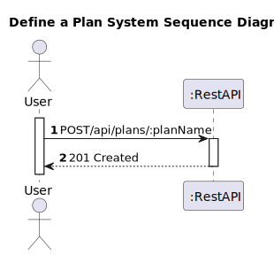
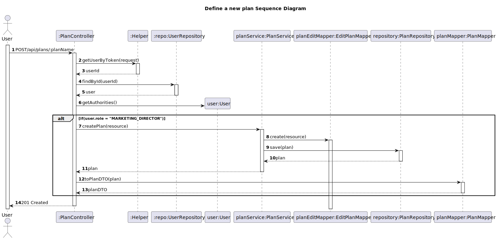

# US 03 - Define a new plan

## 1. Requirements Engineering

### 1.1. User Story Description

As Marketing director, I want to define a new plan detailing the monthly and annual cost, the maximum number of devices and other characteristics of the plan

### 1.2. Customer Specifications and Clarifications 

**From the client clarifications:**
> **Question:**
>I would like to know what are the acceptance criteria in relation to US 3.
> 
> **Answer:**
> As Marketing director, I want to define a new Plan detailing the monthly and annual cost, the maximum number of devices and other characteristics of the plan
the user must be able to enter the plan name, a brief description as HTML text, the monthly and annual cost of the plan, the maximum number of devices, the maximum number of collections, if it includes music suggestion, and the number of included minutes. All of this information is mandatory. The plan name must be unique.
> 
> **Question:**
> I would like to know if the maximum number of devices shown in the plan table corresponds to the maximum number of devices that can be associated with the account/user or if this number corresponds to the limit of devices connected to the account/user at the same time.
>
> **Answer:**
> Corresponds to the maximum number of devices associated with the account

### 1.3. Acceptance Criteria

* The user must be able to enter the plan name, a brief description as HTML text, the monthly and annual cost of the plan, the maximum number of devices, the maximum number of collections, if it includes music suggestion, and the number of included minutes. All of this information is mandatory. The plan name must be unique.
* Analysis and design documentation
* OpenAPI specification
* POSTMAN collection with sample requests for all the use cases with tests
* Proper handling of concurrent access

### 1.4. Found out Dependencies

* D003-01: For a Marketing director to be able to define a new plan he must detail the monthly and annual cost, the maximum number of devices and other characteristics of the plan.

### 1.5 Input and Output Data

**Input Data:**
* Typed Data:
   * planName
   * numberOfMinutes
   * planDescription
   * maxUsers
   * musicCollections
   * musicSuggestions
   * monthlyFee
   * annualFee
   * isActive
   * isPromoted
 
**Output Data:**
* Informs of operation success/failure

### 1.6. System Sequence Diagram (SSD)

### 1.7 Other Relevant Remarks

## 2. Design - User Story Realization 

### 2.1. Rationale

### Systematization ##

 * Plan
 * User

Other software classes (i.e. Pure Fabrication) identified:
  * PlanController
  * PlanMapper
  * PlanDTO
  * PlanService
  * Helper
  * UserRepository
 

## 2.2. Sequence Diagram (SD)

