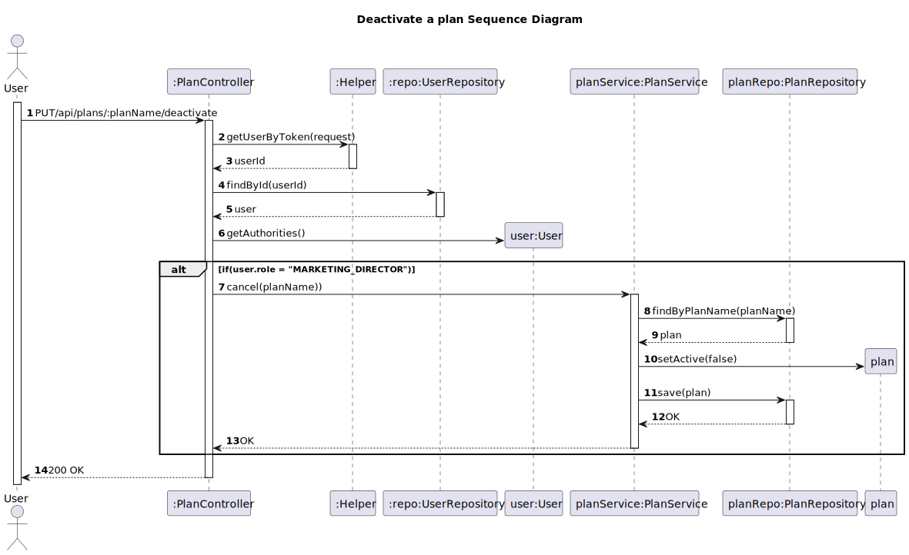

# US 04 - Deactivate a plan

## 1. Requirements Engineering

### 1.1. User Story Description

As Marketing director, I want to deactivate a plan

### 1.2. Customer Specifications and Clarifications 

**From the specifications document:**

>
>
**From the client clarifications:**
> **Question:**
>
> **Answer:**

### 1.3. Acceptance Criteria

* Analysis and design documentation
* OpenAPI specification
* POSTMAN collection with sample requests for all the use cases with tests
* Proper handling of concurrent access

### 1.4. Found out Dependencies

* D003-01: For a marketing director to deactivate a plan it has to exist before.

### 1.5 Input and Output Data

**Input Data:**
* Typed Data:
    * isActive

**Output Data:**
* Informs of operation success/failure

### 1.6. System Sequence Diagram (SSD)

### 1.7 Other Relevant Remarks

## 2. OO Analysis

## 2. Design - User Story Realization 

### 2.1. Rationale

### Systematization ##

According to the taken rationale, the conceptual classes promoted to software classes are: 

* Plan

Other software classes (i.e. Pure Fabrication) identified:
*  PlanController
*  PlanService
*  PlanRepository

## 2.2. Sequence Diagram (SD)

# 3. Tests 
*In this section, it is suggested to systematize how the tests were designed to allow a correct measurement of requirements fulfilling.* 

**_DO NOT COPY ALL DEVELOPED TESTS HERE_**

**Test 1:** Check that it is not possible to create an instance of the Example class with empty values. 

    class ExampleFixture : public ::testing::Test {
        TEST_F(ExampleFixture, CreateWithEmptyCode){
            EXPECT_THROW(new Example(L"",L"Example One"),std::invalid_argument);
        }
    }
	

*It is also recommended organizing this content by subsections.* 

# 4. Construction (Implementation)

*In this section, it is suggested to provide, if necessary, some evidence that the construction/implementation is in accordance with the previously carried out design. Furthermore, it is recommeded to mention/describe the existence of other relevant (e.g. configuration) files and highlight relevant commits.*

*It is also recommended to organize this content by subsections.* 

# 5. Integration and Demo 

*In this section, it is suggested to describe the efforts made to integrate this functionality with the other features of the system.*

# 6. Observations

*In this section, it is suggested to present a critical perspective on the developed work, pointing, for example, to other alternatives and or future related work.*

