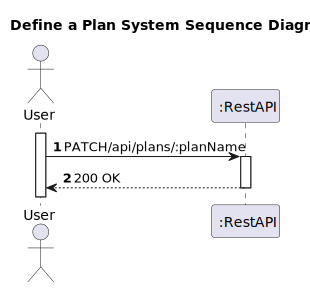
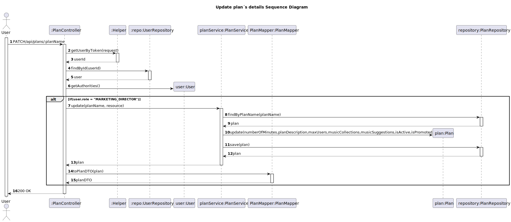

# US 05 - Update a plan

## 1. Requirements Engineering

### 1.1. User Story Description
As marketing director, I want to change a plan’s details other than pricing

### 1.2. Customer Specifications and Clarifications

**From the client clarifications:**
> **Question:**
> In US5 I would like to know if the customer can also change the status of the plan, that is, for a deactivated plan, as in US4. By the way, I would also like to know if a plan that was deactivated can be activated again.
> 
> **Answer:**
> US4 and US5 are two different user stories. US4 deactivating a plan only deactivates the plan. US5 change plan features except price. It does not change whether the plan is active or not. A deactivated plan will in the future be terminated "ceased" but it is not possible to be active again

> **Question:**
> Could indicate what are the acceptance criteria for the US 5?
> 
>  **Answer:**
> The marketing director can update any of the plan's attributes except its name and price.
> 

### 1.3. Acceptance Criteria

* Analysis and design documentation
* OpenAPI specification
* POSTMAN collection with sample requests for all the use cases with tests
* Proper handling of concurrent access

### 1.4. Found out Dependencies

* D005-01: For a Marketing director to be able to change a plan’s details other than pricing must be created a plan first.

### 1.5 Input and Output Data

**Input Data:**
* Typed Data:
  * numberOfMinutes
  * planDescription
  * maxUsers
  * musicCollections
  * musicSuggestions
  * monthlyFee
  * annualFee
  * isActive
  * isPromoted

**Output Data:**
* Informs of operation success/failure

### 1.6. System Sequence Diagram (SSD)

### 1.7 Other Relevant Remarks

## 2. Design - User Story Realization

### 2.1. Rationale

### Systematization ##

* Plan
* User
Other software classes (i.e. Pure Fabrication) identified:
*  PlanController
*  PlanService
*  Helper
*  UserRepository
*  PlanRepository

## 2.2. Sequence Diagram (SD)

