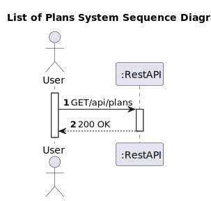
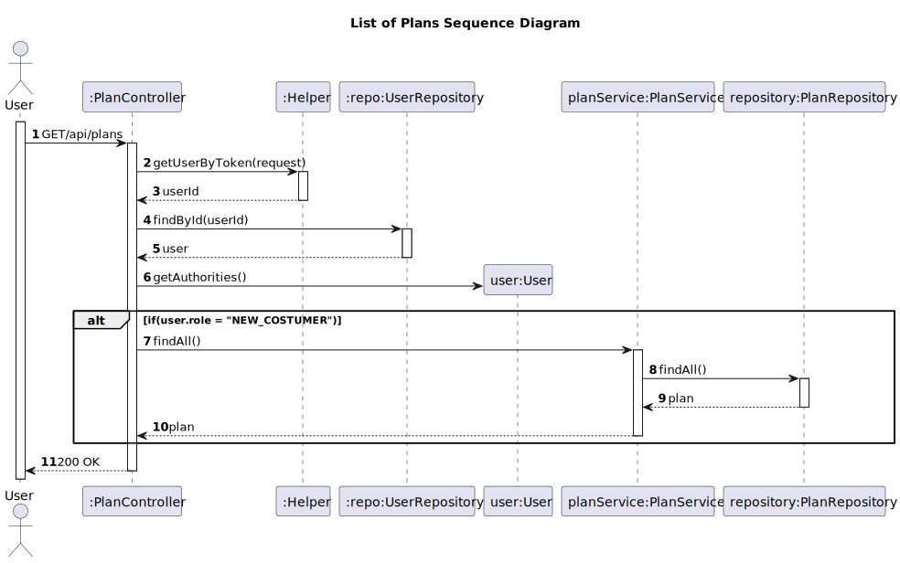

# US 06 - List of plans

## 1. Requirements Engineering

### 1.1. User Story Description

As a new customer I want to know all existing plans

### 1.2. Customer Specifications and Clarifications

**From the client clarifications:**
> **Question:**
> In US6, what should be the plan information that should be shown to the customer? I assume they are: -Annual Price, Monthly Price, Number of minutes, No. Max Devices, No. Music collections, Music recommendations. Should I add any?
>
> **Answer:**
> It should also show whether it is a promoted plan or not.
>
>  **Question:**
> For us 6 ("As a new customer I want to know all the existing plans") I wanted to know if the customer only wants to show the active plans or all the plans that exist without any conditions.
> 
> **Answer:**
> Only active plans.

### 1.3. Acceptance Criteria

* Analysis and design documentation
* OpenAPI specification
* POSTMAN collection with sample requests for all the use cases with tests
* Proper handling of concurrent access

### 1.4. Found out Dependencies

* D006-01: For a new customer, know all existing plans must be created plans first

### 1.5 Input and Output Data

**Output Data:**
* Informs of operation success/failure

### 1.6. System Sequence Diagram (SSD)

### 1.7 Other Relevant Remarks

## 2. Design - User Story Realization

### 2.1. Rationale

### Systematization ##

* Plan
* User

Other software classes (i.e. Pure Fabrication) identified:

* PlanController
* PlanMapper
* PlanDTO
* PlanService
* Helper
* UserRepository

## 2.2. Sequence Diagram (SD)

