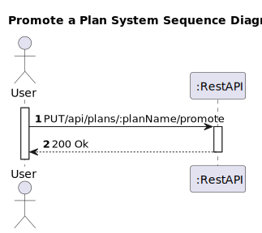
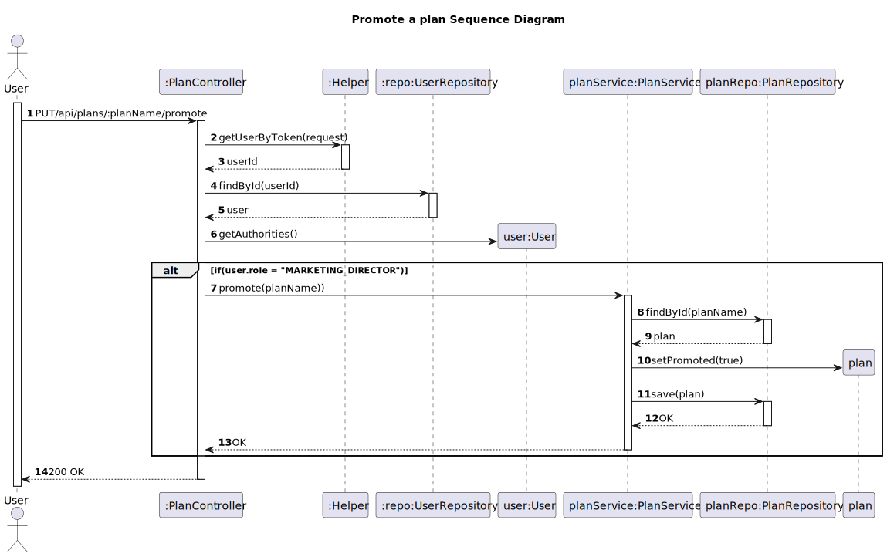

# US 20 - Promote a plan

## 1. Requirements Engineering

### 1.1. User Story Description
As marketing director, I want to promote a plan.

### 1.2. Customer Specifications and Clarifications 

**From the client clarifications:**
> **Question:**
> Just to be sure I would like to know if the "marketing director" is able to promote several plans or only exclusively one at a time, i.e. if one plan is promoted the others cannot be.

> **Answer:**
> Only one plan is promoted at each moment.

### 1.3. Acceptance Criteria

* The user must be able to enter the plan name, a brief description as HTML text, the monthly and annual cost of the plan, the maximum number of devices, the maximum number of collections, if it includes music suggestion, and the number of included minutes. All of this information is mandatory. The plan name must be unique.
* Analysis and design documentation
* OpenAPI specification
* POSTMAN collection with sample requests for all the use cases with tests
* Proper handling of concurrent access

### 1.4. Found out Dependencies

* D020-01: For a plan to be promoted, there must be a plan.

### 1.5 Input and Output Data

**Input Data:**
* Typed Data:

 
**Output Data:**
* Informs of operation success/failure

### 1.6. System Sequence Diagram (SSD)

### 1.7 Other Relevant Remarks

## 2. Design - User Story Realization 

### 2.1. Rationale

### Systematization ##

 * Plan
 * User

Other software classes (i.e. Pure Fabrication) identified:
  * PlanController
  * PlanMapper
  * PlanDTO
  * PlanService 
  * Helper
  * UserRepository
 

## 2.2. Sequence Diagram (SD)

