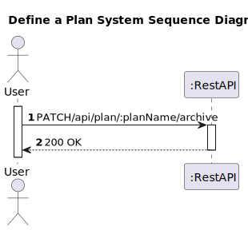
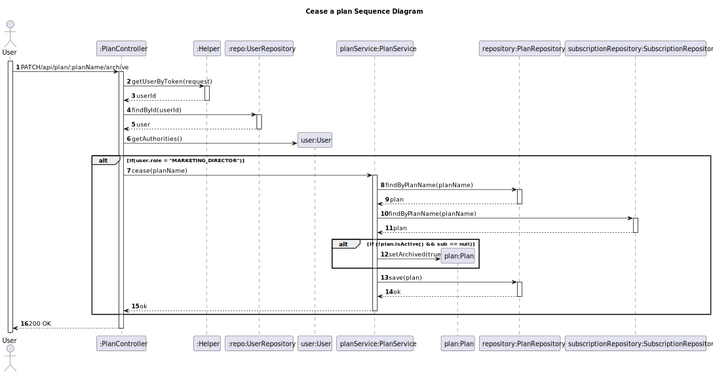

# US 21 - Cease a plan

## 1. Requirements Engineering

### 1.1. User Story Description
As marketing director, I want to cease a plan.

### 1.2. Customer Specifications and Clarifications 

**From the client clarifications:**
> **Question:**
> In US 21 (As marketing director, I want to cease a plan.), does the customer intend to erase the plan completely? If so, can it be deleted with subscriptions still related to the plan you intend to carry out "cease"?
> 
> **Answer:**
> It is intended that the plan be considered as "archived" no longer appearing in listings and dashboards. You can only file a plan that is inactive and no longer has subscriptions

### 1.3. Acceptance Criteria

* The user must be able to enter the plan name, a brief description as HTML text, the monthly and annual cost of the plan, the maximum number of devices, the maximum number of collections, if it includes music suggestion, and the number of included minutes. All of this information is mandatory. The plan name must be unique.
* Analysis and design documentation
* OpenAPI specification
* POSTMAN collection with sample requests for all the use cases with tests
* Proper handling of concurrent access

### 1.4. Found out Dependencies

* D021-01: For a Marketing director to be able to cease a plan, the plan must be inactive and without subscriptions;

### 1.5 Input and Output Data

**Input Data:**
* Typed Data:
  n/a
 
**Output Data:**
* Informs of operation success/failure

### 1.6. System Sequence Diagram (SSD)

### 1.7 Other Relevant Remarks

## 2. Design - User Story Realization 

### 2.1. Rationale

### Systematization ##

 * Plan
 * User

Other software classes (i.e. Pure Fabrication) identified:
*  PlanController
*  PlanService
*  PlanRepository
*  Helper
*  UserRepository
 

## 2.2. Sequence Diagram (SD)

