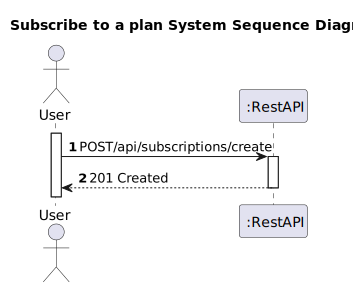
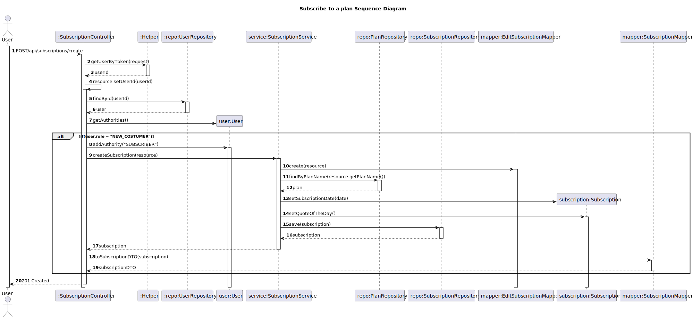

# US 07 - To subscribe to a plan

## 1. Requirements Engineering

### 1.1. User Story Description

As a new customer, I want to subscribe to a plan

### 1.2. Customer Specifications and Clarifications 

**From the client clarifications:**

> **Question:** I would like to know if the customer, when he registers, gets the free subscription right away?
>
> **Answer:** Ideally, customer registration is done at the same time as subscription (US 7. As a new customer I want to subscribe to a plan). if for some reason you want or need to separate the user registration from the subscription, at the time of registration the customer will not have any plan subscribed
> 
> **Question:** I would like to know which fields a new customer needs to fill in to subscribe?
> 
> **Answer:** Must indicate which plan is selected and the frequency of payment (monthly or annual)
              If you implement the simultaneous subscription and user registration use case, they must introduce the user's identification data: username, password, full name and optionally a photo/avatar
> 
> **Question:** I would like to know what are the attributes and acceptance criteria of a subscription/client?
> 
> **Answer:** The selected plan and payment frequency are mandatory
              In user registration: username, password, full name are mandatory. 
>             photo/avatar optional. 
>             username is the email address. 
>             the password must contain at least 1 uppercase and 1 special character and at least 8 characters. 
>             the name is a string with a maximum of 50 characters

### 1.3. Acceptance Criteria

* Analysis and design documentation
* OpenAPI specification
* POSTMAN collection with sample requests for all the use cases with tests
* Proper handling of concurrent access
* username(email), password and full name are mandatory.
* Password must be between 8 and 50 characters long. It must also contain 1 or more capital letters as well as a special character.

### 1.4. Found out Dependencies

* D007-01: For a client to be able to subscribe to a new plan he must first have an account created.
* D007-02: For a client to be able to subscribe to a new plan he mustn't be subscribed to the new plan already.
* D007-03: This US also depends on US03 which represents the definition of a new plan. If there are no plans available, the user can't subscribe to any plan.

### 1.5 Input and Output Data

**Input Data:**
* Typed Data:
  * planName
  * paymentFrequency

* Inserted data: 

**Output Data:**
* Informs operation success/failure

### 1.6. System Sequence Diagram (SSD)

### 1.7 Other Relevant Remarks

## 2. OO Analysis

### 2.1. Other Remarks

## 3. Design - User Story Realization 

### 3.1. Rationale

### Systematization ##

According to the taken rationale, the conceptual classes promoted to software classes are: 

 * Subscription
 * User

Other software classes (i.e. Pure Fabrication) identified: 
* SubscriptionController
* SubscriptionService
* SubscriptionRepository
* Helper
* UserRepository
* EditSubscriptionMapper
* SubscriptionMapper
* PlanRepository

## 3.2. Sequence Diagram (SD)

# 4. Tests 

# 5. Construction (Implementation)

# 6. Integration and Demo 

# 7. Observations

