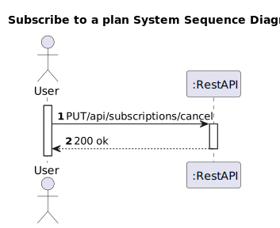
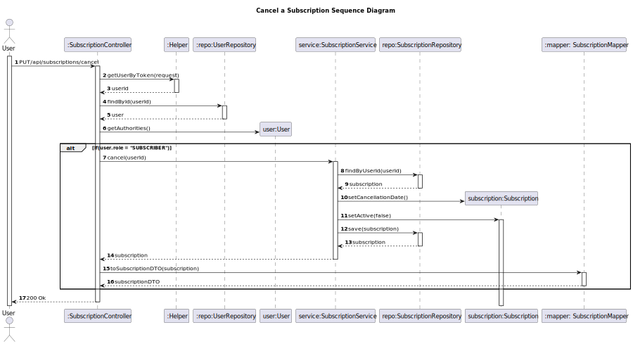

# US 08 - To cancel a subscription

## 1. Requirements Engineering

### 1.1. User Story Description

As subscriber, I want to cancel my subscription

### 1.2. Customer Specifications and Clarifications 

**From the client clarifications:**

> **Question:** Regarding US08, does canceling a subscription imply removing it from the system or not?
>
> **Answer:** Canceling a subscription means that the user no longer has access to the service. 
>             The system must keep account information for 30 days if the customer wishes to reactivate it. 
>             After that period all personal data must be anonymized but the remaining information kept for statistical purposes
>
>  **Question:** I would like to know if a customer who wants to unsubscribe needs to give some confirmation, such as entering the password, for example.
> 
>  **Answer:** It is not necessary. This confirmation is the responsibility of the UI application that is not part of the scope of the project.
### 1.3. Acceptance Criteria

* Analysis and design documentation
* OpenAPI specification
* POSTMAN collection with sample requests for all the use cases with tests
* Proper handling of concurrent access
* After cancelling a subscription it's data should be kept for 30 days in case the account is reactivated.
After this period user data should become anonymous. However, the remaining data should be kept for statistics.

### 1.4. Found out Dependencies

* D008-01: For a client to be able to cancel a subscription, he must have a subscription.

### 1.5 Input and Output Data

**Input Data:**
* Typed Data:
  * subscriptionId

**Output Data:**
* Informs operation success/failure

### 1.6. System Sequence Diagram (SSD)

### 1.7 Other Relevant Remarks

## 2. OO Analysis

### 2.1. Other Remarks

## 3. Design - User Story Realization 

### 3.1. Rationale

### Systematization ##

According to the taken rationale, the conceptual classes promoted to software classes are: 

 * Subscription
 * User

Other software classes (i.e. Pure Fabrication) identified: 
* SubscriptionController
* SubscriptionService
* SubscriptionRepository
* Helper
* UserRepository
* SubscriptionMapper
* 

## 3.2. Sequence Diagram (SD)

# 4. Tests 

# 5. Construction (Implementation)

# 6. Integration and Demo 

# 7. Observations

