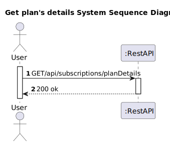

# US 09 - To know the details of my plan

## 1. Requirements Engineering

### 1.1. User Story Description

As subscriber, I want to know the details of my plan

### 1.2. Customer Specifications and Clarifications 

**From the client clarifications:**

> **Question:**
>
> **Answer:**
> 
### 1.3. Acceptance Criteria

* Analysis and design documentation
* OpenAPI specification
* POSTMAN collection with sample requests for all the use cases with tests
* Proper handling of concurrent access

### 1.4. Found out Dependencies

* D009-01: For a client to be able to see the details of his plan he must have subscribed to a plan beforehand.

### 1.5 Input and Output Data

**Input Data:**
* Typed Data:
  * subscriptionId

**Output Data:**
* Informs operation success/failure

### 1.6. System Sequence Diagram (SSD)

### 1.7 Other Relevant Remarks

## 2. OO Analysis

### 2.2. Other Remarks

## 3. Design - User Story Realization 

### 3.1. Rationale

### Systematization ##

According to the taken rationale, the conceptual classes promoted to software classes are: 

 * Subscription
 * user

Other software classes (i.e. Pure Fabrication) identified: 
* SubscriptionController
* SubscriptionRepository
* PlanRepository
* UserRepository
* PlanMapper
* Helper

## 3.2. Sequence Diagram (SD)

# 4. Tests 

# 5. Construction (Implementation)

# 6. Integration and Demo 

# 7. Observations

