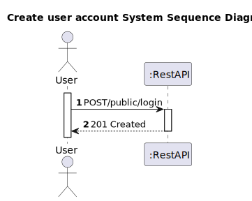
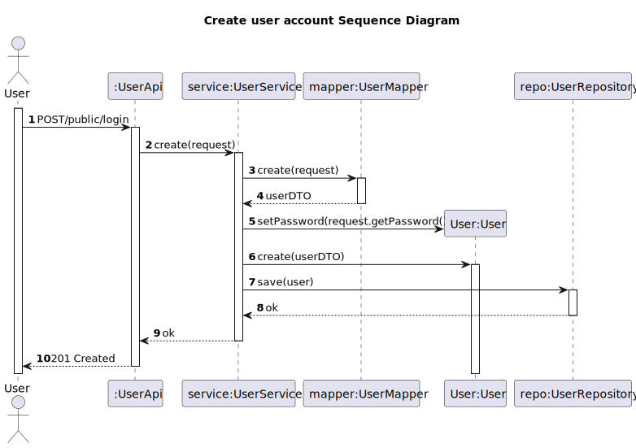

# US 36 - To create user account

## 1. Requirements Engineering

### 1.1. User Story Description

As a new customer, I want to create my account

### 1.2. Customer Specifications and Clarifications 

**From the client clarifications:**

> **Question:** I would like to know what are the attributes and acceptance criteria of a subscription/client?
> 
> **Answer:** The selected plan and payment frequency are mandatory
              In user registration: username, password, full name are mandatory. 
>             photo/avatar optional. 
>             username is the email address. 
>             the password must contain at least 1 uppercase and 1 special character and at least 8 characters. 
>             the name is a string with a maximum of 50 characters

### 1.3. Acceptance Criteria

* Analysis and design documentation
* OpenAPI specification
* POSTMAN collection with sample requests for all the use cases with tests
* Proper handling of concurrent access
* username(email), password and full name are mandatory.
* Password must be between 8 and 50 characters long. It must also contain 1 or more capital letters as well as a special character.

### 1.4. Found out Dependencies

### 1.5 Input and Output Data

**Input Data:**
* Typed Data:
  * username (email)
  * password
  * rePassword
  * fullName

* Inserted data:

**Output Data:**
* Informs operation success/failure

### 1.6. System Sequence Diagram (SSD)

### 1.7 Other Relevant Remarks

## 2. OO Analysis

### 2.1. Other Remarks

## 3. Design - User Story Realization 

### 3.1. Rationale

### Systematization ##

According to the taken rationale, the conceptual classes promoted to software classes are: 

 * User

Other software classes (i.e. Pure Fabrication) identified: 
* UserAdminApi
* UserService
* UserRepository
* UserMapper

## 3.2. Sequence Diagram (SD)

# 4. Tests 

# 5. Construction (Implementation)

# 6. Integration and Demo 

# 7. Observations

