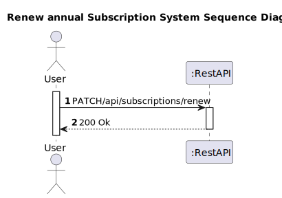
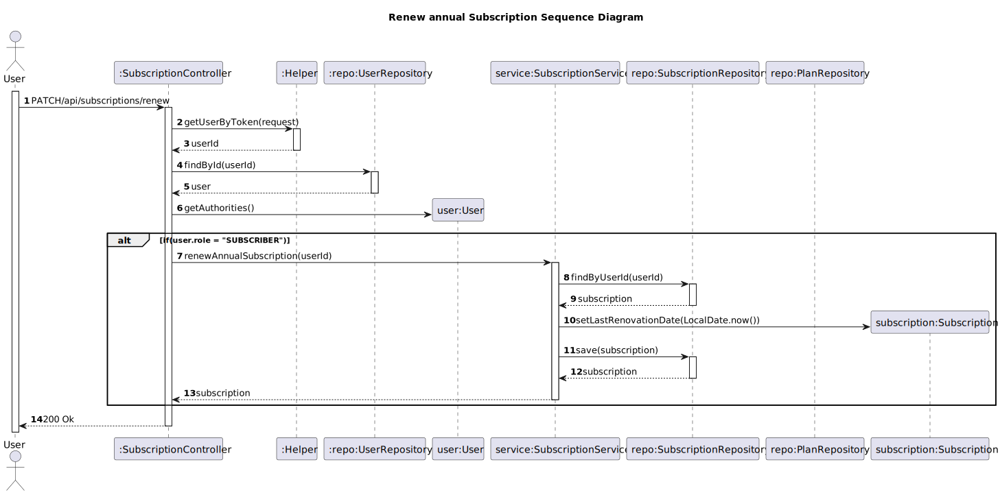

# US 24 - Renew annual Subscription

## 1. Requirements Engineering

### 1.1. User Story Description

As subscriber, I want to renew my annual subscription

### 1.2. Customer Specifications and Clarifications 

**From the client clarifications:**

>  **Question:** When a subscription is made, depending on the type of payment, can I calculate a subscription end date or is this only defined when the user cancels the subscription, assuming that he will always renew until he cancels his subscription?
>                Taking into account that US23 - "As subscriber I want to renew my annual subscription" is the only one that renews subscriptions, assuming that I set the subscription end date at the time of subscription, is there no way to renew monthly subscriptions? or do i assume monthly subscriptions are always renewed and just set an end date at the time the subscriber cancels?
>
> **Answer:** monthly subscriptions are assumed to be renewable every month.
>             In the case of annual subscriptions, it is assumed that they will have an end date of 12 months after subscription/renewal.

### 1.3. Acceptance Criteria

* Analysis and design documentation
* OpenAPI specification
* POSTMAN collection with sample requests for all the use cases with tests
* Proper handling of concurrent access

### 1.4. Found out Dependencies

* D023-01: For a client to be able to renew his annual subscription, he must have a payment frequency defined as annually.

### 1.5 Input and Output Data

**Input Data:**
* Typed Data:

* Inserted data: 

**Output Data:**
* Informs operation success/failure

### 1.6. System Sequence Diagram (SSD)

### 1.7 Other Relevant Remarks

## 2. OO Analysis

### 2.1. Other Remarks

## 3. Design - User Story Realization 

### 3.1. Rationale

### Systematization ##

According to the taken rationale, the conceptual classes promoted to software classes are: 

 * Subscription
 * User

Other software classes (i.e. Pure Fabrication) identified: 
* SubscriptionController
* SubscriptionService
* SubscriptionRepository
* PlanRepository
* Helper
* UserRepository

## 3.2. Sequence Diagram (SD)

# 4. Tests 

# 5. Construction (Implementation)

# 6. Integration and Demo 

# 7. Observations

