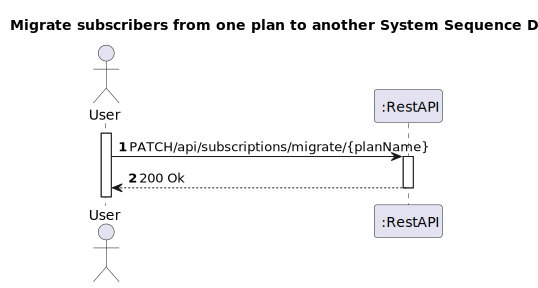
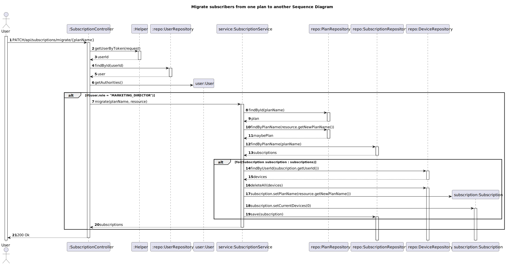

# US 24 - To migrate all subscribers of a certain plan to a different plan

## 1. Requirements Engineering

### 1.1. User Story Description

As marketing director, I want to migrate all subscribers of a certain plan to a different plan

### 1.2. Customer Specifications and Clarifications 

**From the client clarifications:**

> **Question:** us 24- When a user upgrades/downgrades his plan, does his new plan take effect immediately, or only when his current subscription ends? 
>               With immediate effect, your previous subscription is canceled.
>
> **Answer:** Takes effect immediately.
> 
> **Question:** US 22 and 24 - when the customer's plan is changed, do we have to delete the previously associated devices, being necessary to introduce them again or should we migrate them to the new subscription? 
>               Since if the plan reduces the maximum number of devices, it may not be possible to keep all those that were already associated with the subscription.
>               If we don't delete the devices from the subscription, how do we choose which ones should remain in case there is a reduction in the maximum number of devices?
> 
> **Answer:** If the new plan does not allow keeping the same number of devices that the customer currently has, it should not be possible to change the plan. 
>             The customer must first remove some of his devices and then change plans

### 1.3. Acceptance Criteria

* Analysis and design documentation
* OpenAPI specification
* POSTMAN collection with sample requests for all the use cases with tests
* Proper handling of concurrent access

### 1.4. Found out Dependencies

* D024-01: For a marketing director to be able to place all subscribers from one plan in another plan, the plan he wishes to change the users to must exist.
* 
### 1.5 Input and Output Data

**Input Data:**
* Typed Data:
  * newPlanName

* Inserted data: 

**Output Data:**
* Informs operation success/failure

### 1.6. System Sequence Diagram (SSD)

### 1.7 Other Relevant Remarks

## 2. OO Analysis

### 2.1. Other Remarks

## 3. Design - User Story Realization 

### 3.1. Rationale

### Systematization ##

According to the taken rationale, the conceptual classes promoted to software classes are: 

 * Subscription
 * User

Other software classes (i.e. Pure Fabrication) identified: 
* SubscriptionController
* SubscriptionService
* SubscriptionRepository
* PlanRepository
* Helper
* UserRepository

## 3.2. Sequence Diagram (SD)

# 4. Tests 

# 5. Construction (Implementation)

# 6. Integration and Demo 

# 7. Observations

