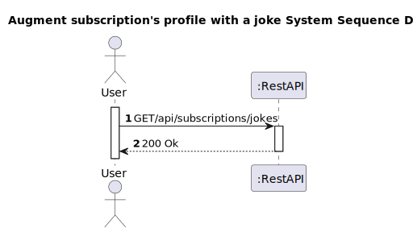
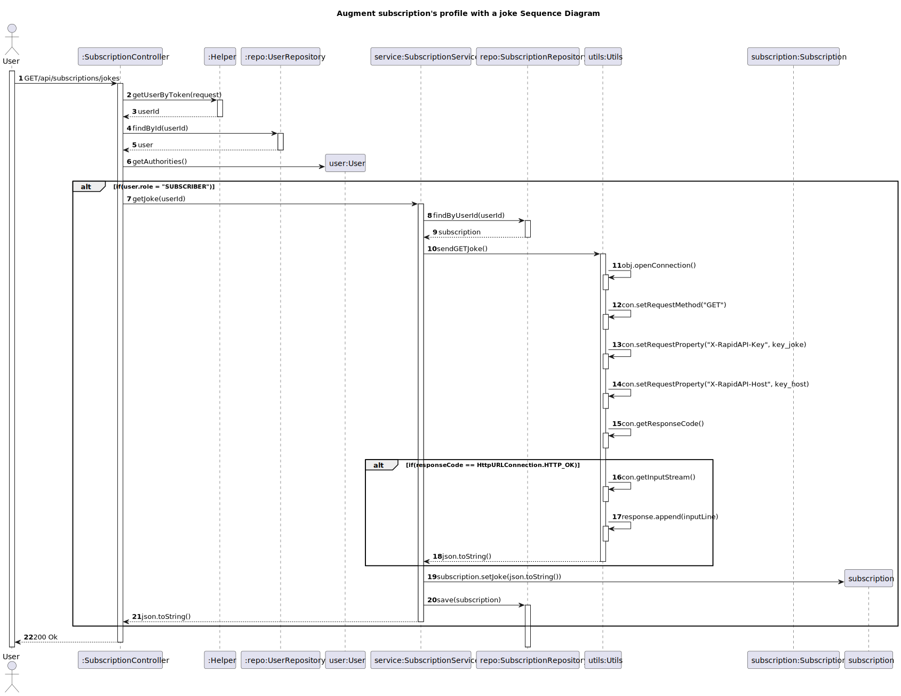

# US 35 - Augment subscription's profile with a joke

## 1. Requirements Engineering

### 1.1. User Story Description

Augment the subscription profile with a funny quote of the day

### 1.2. Customer Specifications and Clarifications 

**From the client clarifications:**

> **Question:** Where is the joke and weather supposed to appear? When the user is logging in or have an endpoint to fetch the logged in user information and also the joke and weather?
>
> **Answer:** This information must be returned when obtaining a user's profile. For example, your subscription details.

### 1.3. Acceptance Criteria

* Analysis and design documentation
* OpenAPI specification
* POSTMAN collection with sample requests for all the use cases with tests
* Proper handling of concurrent access
* username(email), password and full name are mandatory.
* Password must be between 8 and 50 characters long. It must also contain 1 or more capital letters as well as a special character.

### 1.4. Found out Dependencies

### 1.5 Input and Output Data

**Input Data:**
* Typed Data:

* Inserted data: 

**Output Data:**
* Informs operation success/failure

### 1.6. System Sequence Diagram (SSD)

### 1.7 Other Relevant Remarks

## 2. OO Analysis

### 2.1. Other Remarks

## 3. Design - User Story Realization 

### 3.1. Rationale

### Systematization ##

According to the taken rationale, the conceptual classes promoted to software classes are: 

 * Subscription
 * User
 * Utils

Other software classes (i.e. Pure Fabrication) identified: 
* SubscriptionController
* SubscriptionService
* SubscriptionRepository
* Helper
* UserRepository

## 3.2. Sequence Diagram (SD)

# 4. Tests 

# 5. Construction (Implementation)

# 6. Integration and Demo 

# 7. Observations

