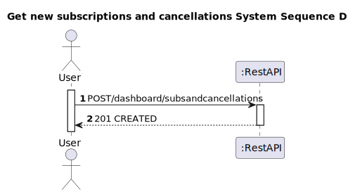
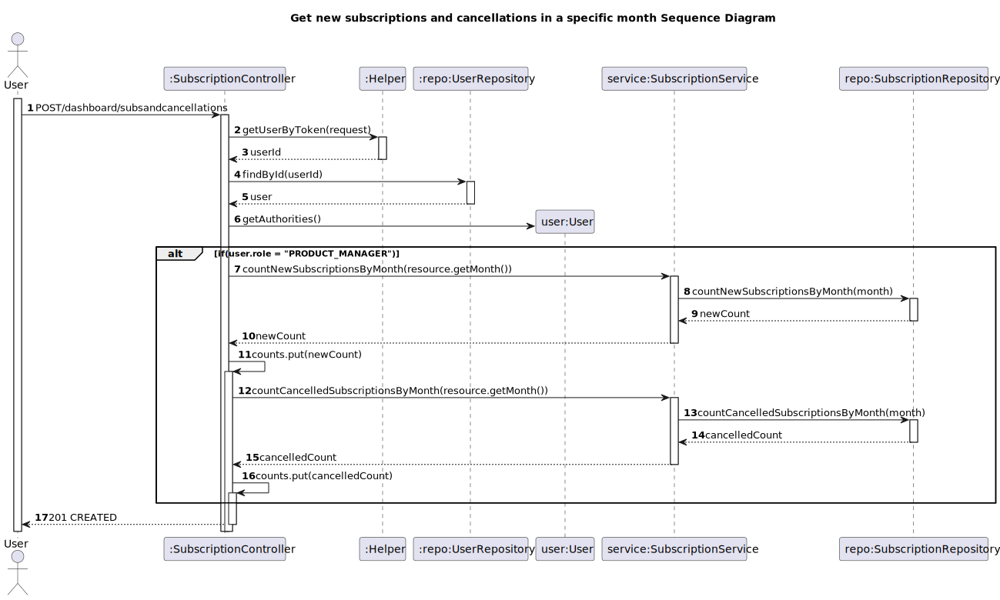

# US 10 - Get new subscriptions and cancellations in a specific month

## 1. Requirements Engineering

### 1.1. User Story Description

As Product Manager I want to know how many new subscribers and cancellations occurred in a
specific month

### 1.2. Customer Specifications and Clarifications 

**From the client clarifications:**
> **Question:**
> Can staff request to individually view subscriptions and cancellations or should they be displayed together.
>
>**Answer:**
> The returned structure should a data structure that can return any data the user desires.
> This means that these two pieces of information can be consulted simultaneously. 
> However, it should be possible to filter this information so as to tell the service that only one of them is desired.

> **Question:**
> Are the searches made by the Dashboard Project Manager to be saved?
> 
> **Answer:**
> No

> **Question:**
> Can a renewal of a subscription be considered a new subscription? If not, how do we distinguish between new subscribers and subscribers who renew their subscription?
>
> **Answer:**
> It is intended to distinguish new subscriptions from renewals. As such, for each subscription it is necessary to know the date on which it was subscribed and the last date on which it was renewed.

> **Question:**
> What are the acceptance criteria for knowing how many subscribers and cancellations occurred in a specific month. Is there any specific information/data that I should pay more attention to?
> 
> **Answer:**
> Assuming that in a given month the following happened:
> * subscriber 123 unsubscribed
> * new subscriber 456
> * new subscriber 457
> * **the dashboard should show:**
> * cancellations: 1
> * new subscriptions: 2
 

### 1.3. Acceptance Criteria

* Analysis and design documentation
* OpenAPI specification
* POSTMAN collection with sample requests for all the use cases with tests
* Proper handling of concurrent access

### 1.4. Found out Dependencies

* D010-01: For the product manager to obtain the list of new subscribers and cancellation it is necessary to have these 2 cases previously.

### 1.5 Input and Output Data

**Input Data:**
* Typed Data:
    * month

**Output Data:**
* Informs operation success/failure

### 1.6. System Sequence Diagram (SSD)

*Insert here a SSD depicting the envisioned Actor-System interactions and throughout which data is inputted and outputted to fulfill the requirement. All interactions must be numbered.*

### 1.7 Other Relevant Remarks

*Use this section to capture other relevant information that is related with this US such as (i) special requirements ; (ii) data and/or technology variations; (iii) how often this US is held.* 

## 2. Design - User Story Realization 

### 2.1. Rationale

### Systematization ##

According to the taken rationale, the conceptual classes promoted to software classes are:

* Subscription
* User
Other software classes (i.e. Pure Fabrication) identified:

* Helper
* UserRepository
* SubscriptionController
* SubscriptionService
* SubscriptionRepository

## 2.2. Sequence Diagram (SD)

*In this section, it is suggested to present an UML dynamic view stating the sequence of domain related software objects' interactions that allows to fulfill the requirement.* 

