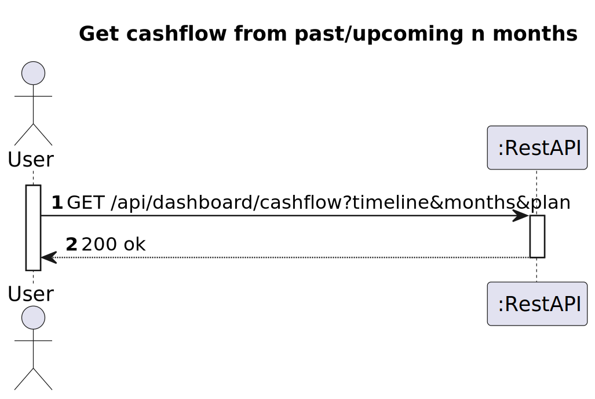
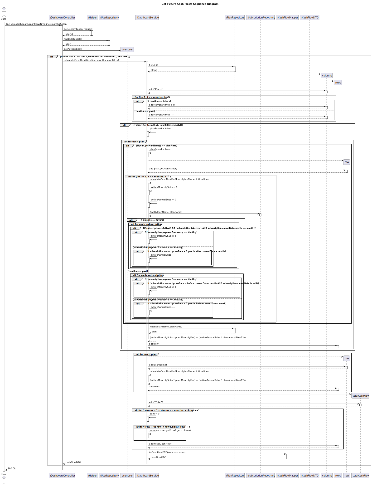

# US 25 - Get future cashflow for the upcoming *n* months by plan

## 1. Requirements Engineering

### 1.1. User Story Description

As a Product Manager or Financial director, I want to know the future cashflows for the past/upcoming n months filtered/broken down by plan.


### 1.2. Customer Specifications and Clarifications 

**From the specifications document:**
> The monthly revenue is obtained by simply multiplying the monthly fee of each plan by the number of active subscribers
>
> For annual subscriptions the revenue calculations must use the proportional monthly fee based on the annual
fee.
> 
> The cash flow map is a timeline-based listing of the cash the company has received/will receive per month,
on the last/upcoming n months

**From the client clarifications:**
> **Question:**
> Is it possible to have a null value for the plan filter?

>**Answer:**
> The plan filter is optional. In that case you should present all plans.

### 1.3. Acceptance Criteria

* Analysis and design documentation
* OpenAPI specification
* POSTMAN collection with sample requests for all the use cases with tests
* Proper handling of concurrent access

### 1.4. Found out Dependencies

* D025-01:

### 1.5 Input and Output Data

**Input Data:**
* Typed Data:
    * timeline (past/future) 
    * months
    * planFilter (optional)

**Output Data:**
* DTO with the following presentation:
  * | Plan   | current month | month 2 | month 3 | ... | month n  |                   
    |:-------|:--------------|---------|---------|-----|----------|
    | Free   | x.xx €        | x.xx €  | x.xx €  | x.xx €  | x.xx €   |
    | Silver | x.xx €        | x.xx €  | x.xx €  | x.xx €  | x.xx €   |
    | Gold   | x.xx €        | x.xx €  | x.xx €  | x.xx €  | x.xx €   |
    | ...    | x.xx €        | x.xx €  | x.xx €  | x.xx €  | x.xx €   |
    | TOTAL  | x.xx €        | x.xx €  | x.xx €  | x.xx €  | x.xx €   |


### 1.6. System Sequence Diagram (SSD)





### 1.7 Other Relevant Remarks

The table presented as the outputted data can be represented as a json document such as in the following example:
``` json
{
  "data": {
    "columns": ["Plans", month_1, month_2, month_n],
    "rows": [
      ["Free", 0, 0, 0],
      ["Gold", 120, 180, 220],
      ...
      ["Total", 220, 330, 420]
    ]
  }
}
```

***

The revenue for each month is calculated via this formula:
```
(activeMonthlySubscriptions * plan.MonthlyFee) + (activeAnnualSubs * plan.AnnualFee/12)
```

When checking whether a subscription should be considered in the calculation the following points should be taken into account:
* when estimating future cashflows only currently active monthly subscriptions should be considered except if the cancellation occurred in the same month we are checking
* when retrieving past cashflows only monthly subscriptions that have a subscription date prior to the considered date and do not have a cancellation date should be counted. However, if a cancellation date is present and it occured prior to the date to be analised the subscription should also be counted.

* annual subscriptions can only be counted if their end date (subscription date plus 1 year) doesn't exceed the date we are checking when estimating future cashflows. However, when retrieving past cashflows the opposite should be verified: only when the end date DOES exceed the date we are analysing can the subscription be counted. 

***

If no filter is present all plans should be returned. Otherwise, only consider the plan that matches the filter. 


## 2. Design - User Story Realization 

### 2.1. Rationale

### Systematization ##

Software classes (i.e. Pure Fabrication) identified:

* DashboardController
* DashboardService
* SubscriptionRepository
* PlanRepository
* CashFlowMapper
* CashFlowDTO

## 2.2. Sequence Diagram (SD)




