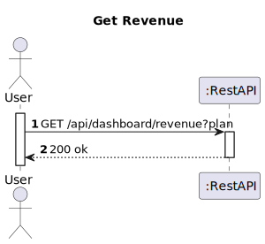

# US 25 - Get Get year-to-date revenue by plan

## 1. Requirements Engineering

### 1.1. User Story Description

As a Product Manager or Financial director, I want to know the year-to-date revenue of my company filtered/broken down by plan.


### 1.2. Customer Specifications and Clarifications 

**From the specifications document:**
> The company needs to track:
> * All the revenue generated so far
> * Future cash flows based on currently active subscriptions
> * Active subscriptions
> * Monthly new subscriptions
> * Monthly canceled subscriptions
> * Churn rate
> 
> All these metrics can be viewed at the company level or broken down by plan. 


**From the client clarifications:**
> **Question:**
> Should the user specify a date from which to get the revenue?

>**Answer:**
> Only data from the current year should be considered.

> **Question:**
> What data should be displayed to the user?

>**Answer:**
> THe revenue data subdivided by plan. 

### 1.3. Acceptance Criteria

* Analysis and design documentation
* OpenAPI specification
* POSTMAN collection with sample requests for all the use cases with tests
* Proper handling of concurrent access

### 1.4 Input and Output Data

**Input Data:**
* Typed Data:
    * planFilter (optional)

**Output Data:**
* DTO with the following presentation:
  * | Plan  | Metric                  | Total  |                
    |:------|:------------------------|--------|
    | Free  | active subscriptions    | x      |
    |       | new subscriptions       | x      | 
    |       | cancelled subscriptions | x      |
    |       | churn rate              | x.xx % | 
    |       | churn rate              | x.xx % | 
  * | ...   | ...                     | ...    | 
    | TOTAL | active subscriptions    | x      |
    |       | new subscriptions       | x      | 
    |       | cancelled subscriptions | x      |
    |       | churn rate              | x.xx % | 
  * |       | churn rate              | x.xx % | 


### 1.5. System Sequence Diagram (SSD)





### 1.6 Other Relevant Remarks

The table presented as the outputted data can be represented as a json document such as in the following example:
``` json
{
  "data": {
    "columns": ["Plan", "Metric", Total],
    "rows": [
        {
            "plan": "Free",
            "metric": {
                "activeSubscriptions": 10,
                "newSubscriptions": 8,
                "cancelledSubscriptions": 4,
                "churnRate": 50.0,
                "revenue": 180.87
            } 
        },
        {
            ...
        },
        {
            "plan": "TOTAL",
            "metric": {
                "activeSubscriptions": 36,
                "newSubscriptions": 24,
                "cancelledSubscriptions": 7,
                "churnRate": 25.0,
                "revenue": 574.13
            }
        }
    ]
  }
}
```

***

The churn rate represents the ratio between new and cancelled subscriptions and is calculated like this:
```
churnRate =  cancelledSubscriptions / activeSubscriptions * 100
```
***

* When calculating new subscriptions, cancellations and the revenue only subscription from the current year should be considered.

***
If no filter is present all plans should be returned. Otherwise, only consider the plan that matches the filter. 


## 2. Design - User Story Realization 

### 2.1. Rationale

### Systematization ##

Software classes (i.e. Pure Fabrication) identified:

* DashboardController
* DashboardService
* SubscriptionRepository
* PlanRepository
* RevenueMapper
* RevenueDTO
* RevenueObj

## 2.2. Sequence Diagram (SD)


