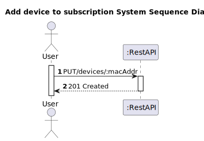
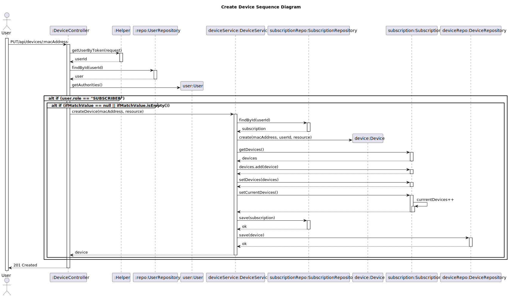

# US 11 - Add device to subscription

## 1. Requirements Engineering

### 1.1. User Story Description

As a subscriber I want to add a new device to my subscription.

### 1.2. Customer Specifications and Clarifications 

**From the client clarifications:**
> **Question:**
> I'd like to know whether a single device can be associated to 2 or more accounts managed by different users.
>
> **Answer:** 
> A device is associated to a single subscription.

> **Question:**
> Are devices associated to subscriptions or to customers ?
>
> **Answer:**
> In this domain, client and subscription are "sinonyms".

> **Question:**
> What fields should be filled when a subscriber adds a new device?
>
> **Answer:**
> The device's MAC address, designation (Tablet Maria) and optionally an image.

> **Question:**
> What are the devices' acceptance criteria?
>
> **Answer:**
> * MAC address is mandatory and should be a valid MAC address.
> * Designation is mandatory and should be alphanumeric with a maximum of 50 characters.
> * Image is optional and can be of any standard image format (jpg, png, ...).

### 1.3. Acceptance Criteria

* MAC address is mandatory and should be a valid MAC address.
* Designation is mandatory and should be alphanumeric with a maximum of 50 characters.
* Image is optional and can be of any standard image format (jpg, png, ...).
* Analysis and design documentation
* OpenAPI specification
* POSTMAN collection with sample requests for all the use cases with tests
* Proper handling of concurrent access
* Only users with "subscriber" role may create new devices

### 1.4. Found out Dependencies

* Cannot exceed maximum number of devices.
* Device must not previously exist.

### 1.5 Input and Output Data

**Input Data:**
* Typed Data:
    * MAC Address
    * designation
  
* Inserted Data:
    * Image (optional)
    * AuthToken

**Output Data:**
* Informs of operation success/failure

### 1.6. System Sequence Diagram (SSD)

### 1.7 Other Relevant Remarks

* Devices are identified by their MAC Address only. 
* The associated subscriptions' currentDevices value should be incremented when adding a new device.
* Subscriptions are accessed via the userId read from the AUthToken.

## 2. Design - User Story Realization 

### 2.1. Rationale

According to the taken rationale, the conceptual classes promoted to software classes are: 

 * Device
 * Subscription

Other software classes (i.e. Pure Fabrication) identified: 
 * DeviceController  
 * DeviceMapper
 * DeviceDTO
 * DeviceService
 * SubscriptionRepository
 * DeviceRepository

## 2.2. Sequence Diagram (SD)

# 3. Tests 

# 4. Construction (Implementation)

# 5. Integration and Demo 

# 6. Observations

