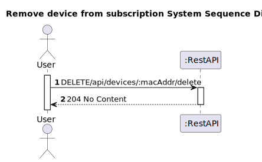
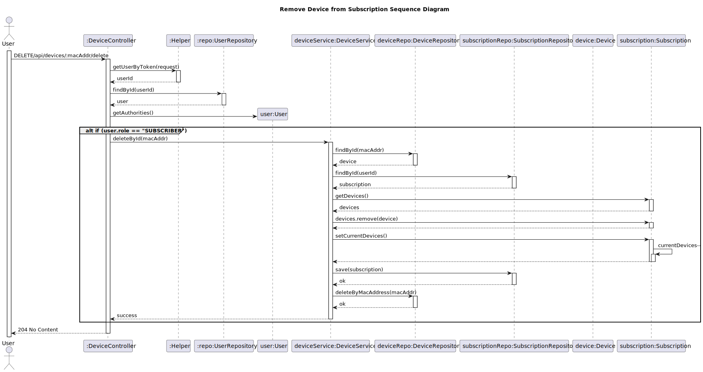

# US 12 - Remove Device from subscription

## 1. Analysis

### 1.1. User Story Description

*As a subscriber I want to remove a device from my subscription.*

### 1.2. Customer Specifications and Clarifications 

**From the client clarifications:**
> **Question:**
> In regards to adding/removing devices to/from a subscription should we consider these operations 
as creating and removing a device, respectively, or, is the purpose to simply (dis)associate a device 
from a subscription. For instance, when removing a device from a subscription are we deleting it or
changing it's state so that it's no longer associated to a subscription.
> 
> **Answer:**
> From a functional standpoint, removing a device corresponds to removing that device entirely from the system so that it can no longer be recognized.

### 1.3. Acceptance Criteria

* Analysis and design documentation
* OpenAPI specification
* POSTMAN collection with sample requests for all the use cases with tests
* Proper handling of concurrent access
* Only users with "subscriber" role may delete a device

### 1.4. Found out Dependencies

* Cannot remove non-existing devices.

### 1.5 Input and Output Data

**Input Data:**
* Typed Data:
    * MAC address
* Inserted Data:
    * AuthToken

**Output Data:**
* Informs of operation success/failure

### 1.6. System Sequence Diagram (SSD)

### 1.7 Other Relevant Remarks

* When a device is removed from a subscription the subscription's currentDevices value should be decremented.
* Subscriptions are accessed via the userId read from the AUthToken.

## 2. Design - User Story Realization 

### 2.1. Rationale

### Systematization ##

According to the taken rationale, the conceptual classes promoted to software classes are: 

* Device
* Subscription

Other software classes (i.e. Pure Fabrication) identified:

* DeviceController
* DeviceService
* SubscriptionRepository
* DeviceRepository

## 2.2. Sequence Diagram (SD)

