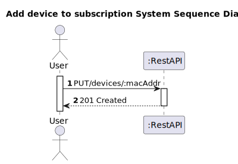
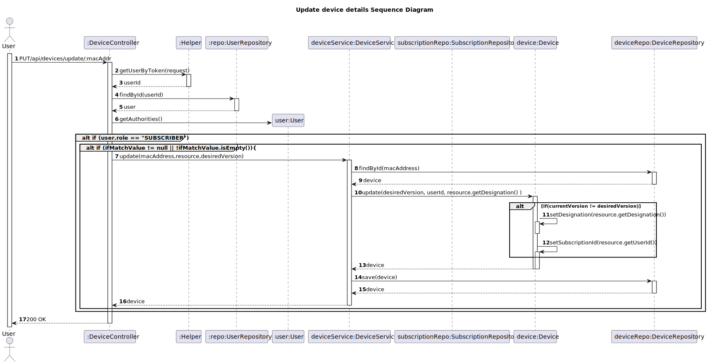

# US 13 - Update device details

## 1. Requirements Engineering

### 1.1. User Story Description

*As a subscriber I want to update the details of my device (name and description).*

### 1.2. Customer Specifications and Clarifications 
*N/A*

### 1.3. Acceptance Criteria

* Analysis and design documentation
* OpenAPI specification
* POSTMAN collection with sample requests for all the use cases with tests
* Proper handling of concurrent access
* The device's image, if provided, should be of any standard image format (jpg, png, ...)
* Only users with "subscriber" role may update a device

### 1.4. Found out Dependencies

* The device must exist.

### 1.5 Input and Output Data

**Input Data:**
* Typed Data:
    * MAC address
    * Designation

* Inserted Data:
    * Image (optional)
    * AuthToken

**Output Data:**
* Informs of operation success/failure

### 1.6. System Sequence Diagram (SSD)

## 1.7 Other Relevant Remarks
* The device's ID (MAC address) can not be updated, only it's description and image can be changed.
* Subscriptions are accessed via the userId read from the AUthToken.

## 2. OO Analysis

### 2.1. Relevant Domain Model Excerpt

## 3. Design - User Story Realization 

### 3.1. Rationale

### Systematization ##

According to the taken rationale, the conceptual classes promoted to software classes are: 

* Device 
* Subscription

Other software classes (i.e. Pure Fabrication) identified:
* DeviceController
* DeviceMapper
* DeviceDTO
* DeviceService
* SubscriptionRepository
* DeviceRepository

## 3.2. Sequence Diagram (SD)

## 3.3. Class Diagram (CD)

