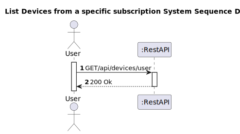
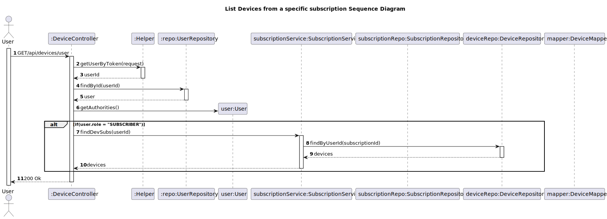

# US 14 - List Devices

## 1. Requirements Engineering

### 1.1. User Story Description

As subscriber I want to list my devices

### 1.2. Customer Specifications and Clarifications 

**From the specifications document:**

>
>

**From the client clarifications:**
> **Question:**
>In US14 (As subscriber I want to list my devices), what information do you want to be displayed?
>
> **Answer:**
> All device features

### 1.3. Acceptance Criteria

* Analysis and design documentation
* OpenAPI specification
* POSTMAN collection with sample requests for all the use cases with tests
* Proper handling of concurrent access

### 1.4. Found out Dependencies

* D014-01: There is a dependency with US11 since a device must be previously added in order to be listed.

### 1.5 Input and Output Data

**Output Data:**
* Informs of operation success/failure

### 1.6. System Sequence Diagram (SSD)

*Insert here a SSD depicting the envisioned Actor-System interactions and throughout which data is inputted and outputted to fulfill the requirement. All interactions must be numbered.*

### 1.7 Other Relevant Remarks

*Use this section to capture other relevant information that is related with this US such as (i) special requirements ; (ii) data and/or technology variations; (iii) how often this US is held.*

## 2. Design - User Story Realization 

### 2.1. Rationale

**The rationale grounds on the SSD interactions and the identified input/output data.**

### Systematization ##

According to the taken rationale, the conceptual classes promoted to software classes are: 

 * Device

Other software classes (i.e. Pure Fabrication) identified: 
* DeviceController
* DeviceService
* DeviceRepository

## 2.2. Sequence Diagram (SD)

*In this section, it is suggested to present an UML dynamic view stating the sequence of domain related software objects' interactions that allows to fulfill the requirement.* 

