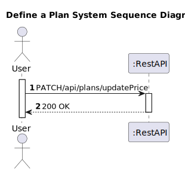
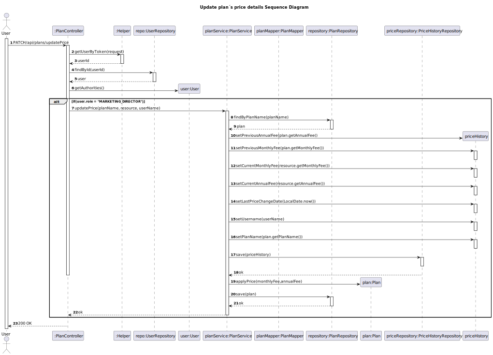

# US 27 - Change the pricing of a plan

## 1. Requirements Engineering

### 1.1. User Story Description
As marketing director, I want to change the pricing of a plan

### 1.2. Customer Specifications and Clarifications

**From the client clarifications:**
> **Question:**
> I would like to know if there are acceptance criteria for US's 27 and 28.
 **Answer:**
> Yes

> **Question:**
> In the work package, when a change is made to the price of the plan (As marketing director, I want to change the pricing of a plan) you also need to save the date of the change and then show it (As marketing director, I want to know the price change history of a plan)?

> **Answer**
> the user must be able to change the price of a plan and the system must save this information so that it can later list the date on which the price was changed, by whom and for what amount.
### 1.3. Acceptance Criteria

* Analysis and design documentation
* OpenAPI specification
* POSTMAN collection with sample requests for all the use cases with tests
* Proper handling of concurrent access

### 1.4. Found out Dependencies

* D021-01: For a Marketing director to be able to change a plan’s price must be created a plan first.

### 1.5 Input and Output Data

**Input Data:**
* Typed Data:
  * monthlyFee
  * annualFee

**Output Data:**
* Informs of operation success/failure

### 1.6. System Sequence Diagram (SSD)

### 1.7 Other Relevant Remarks

## 2. Design - User Story Realization

### 2.1. Rationale

### Systematization ##

* Plan
* User
* PriceHistory

Other software classes (i.e. Pure Fabrication) identified:
*  PlanController
*  PlanService
*  PlanRepository
*  Helper
*  UserRepository
*  PriceHistoryRepository

## 2.2. Sequence Diagram (SD)

